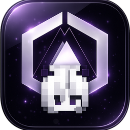

# LbDisCraft

### Seamless **Discord ↔ Minecraft** account linking, security &amp; administration — in one desktop app.

---

## ✨ Overview

**LbDisCraft** connects your Minecraft server to your Discord community and puts everything behind one clean desktop panel. Players link their accounts, secure their logins, and chat across platforms — while you manage it all without touching a config file or hosting a thing yourself.

> Install the app, sign in, fill in a few settings, press **Start**. That's it.

---

## 🚀 Features

| | |
|---|---|
| 🔗 **Account linking** | Players link Discord ↔ Minecraft with an in-game code |
| 🔐 **Two-factor login** | Optional 2FA codes sent by DM on every join |
| 🔔 **Login notifications** | Get a DM whenever your account logs in |
| 💬 **Chat bridge** | Relay chat both ways between Minecraft and Discord |
| 🎭 **Rank → role sync** | Map in-game ranks to Discord roles automatically |
| 📊 **Live status panel** | Server version, latency, online players at a glance |
| 🖥️ **RCON console** | Send commands to your server straight from the panel |
| 👥 **Linked accounts manager** | Per-account 2FA settings and live `/lbstats` data |
| 🌐 **Multi-language templates** | Every bot message is editable and translatable |
| 🎨 **Visual message designer** | Build DM cards block-by-block with a live preview |
| 🪪 **Online licensing** | One account = one server, verified securely |
| ⬇️ **Automatic updates** | Discord-style updater keeps the app &amp; bot current |

---

## 🧩 Components

| Component | What it is |
|---|---|
| **Desktop Panel** | The Windows app you install — dashboard, settings, controls |
| **Discord Bot** | Bundled with the app; runs automatically, no Node.js required |
| **Minecraft Plugin** (`LbDiscordLink.jar`) | Drop into your server's `plugins/` folder to enable in-game linking |

---

## 📦 Installation

1. **Download** the latest `LbDisCraft-Setup-x.y.z.exe` from the [Releases](../../releases) page.
2. **Run** the installer and launch **LbDisCraft**.
3. **Sign in** with your [kadrxy.com](https://kadrxy.com) account *(requires a LbDisCraft license)*.
4. Open **App Settings → Bot Settings** and fill in your Discord token, server host, and RCON details, then **Save**.
5. Go to **Bot Control** and press **Start**.
6. Put `LbDiscordLink.jar` into your Minecraft server's `plugins/` folder and restart the server.

---

## 🔄 Updating

LbDisCraft keeps itself up to date. On every launch a small updater window checks for new versions and updates the app and bot **automatically** before opening — no reinstalling, no manual downloads. Plugin updates are offered in-app with one click.

---

## 🖥️ Requirements

- **Windows 10 / 11** (64-bit)
- A **Discord bot application** (token + client ID)
- A **Minecraft: Java Edition** server *(RCON optional, unlocks console &amp; live stats)*
- A **LbDisCraft license** on your kadrxy.com account

> No Node.js, no separate bot hosting — the bot runs inside the app.

---

## 📥 Download

**→ [Latest Release](../../releases/latest)**

---

## 🪪 License

**Proprietary — © Kadrxy Studios. All rights reserved.**
This software is licensed, not sold. Redistribution, resale, or reverse-engineering is prohibited. See [`LICENSE`](LICENSE) for details.

---

Made with ❤️ by **Kadrxy Studios** — for **LBDevz**

